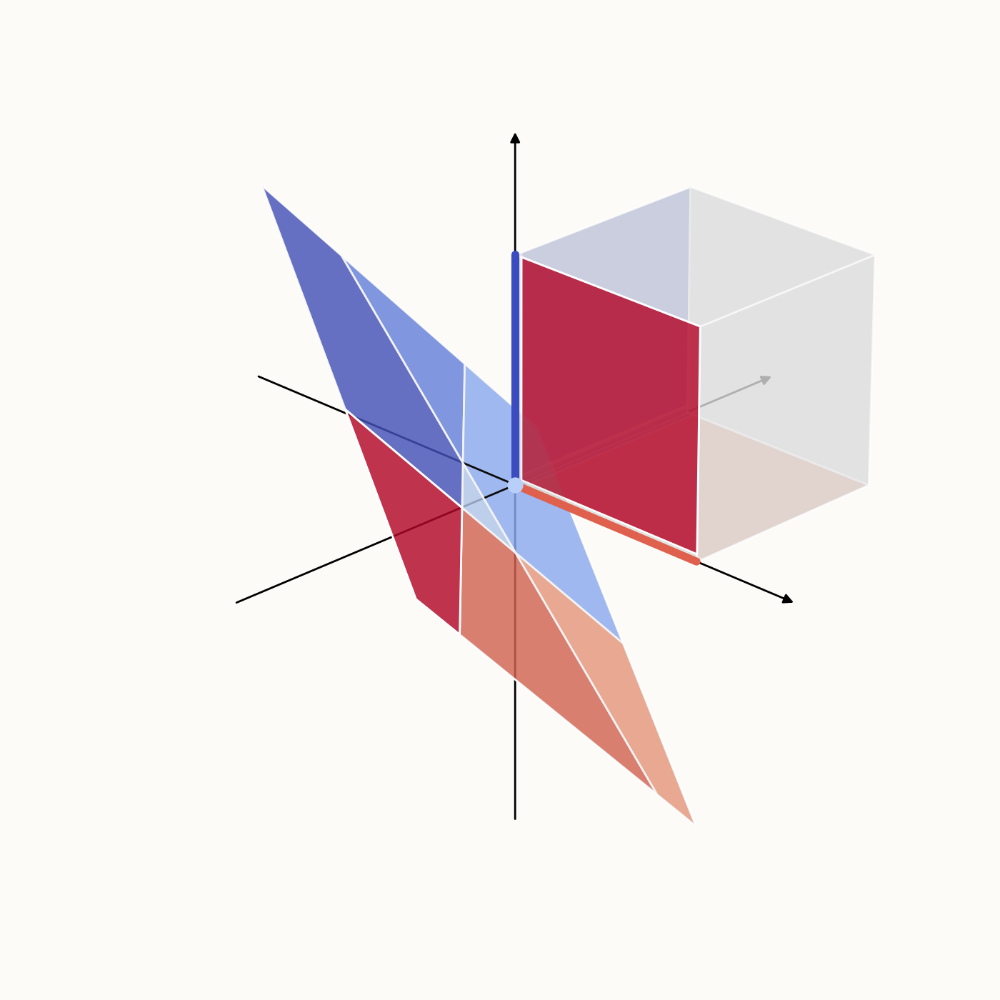
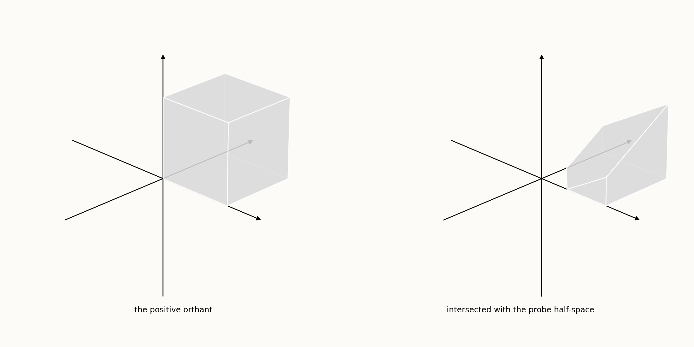
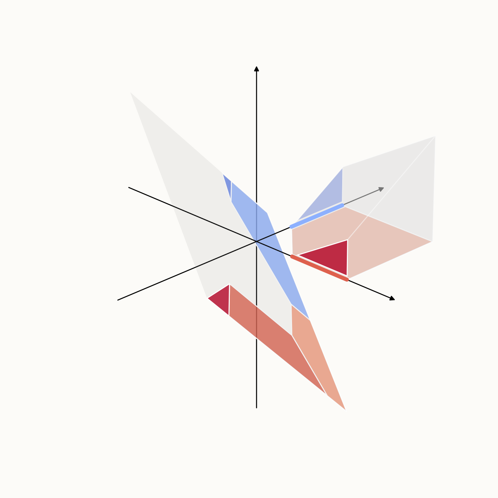

# lat_space_lens

Backpropping feature constraints through ReLU networks to input spaces.

## What this does

Given the following equation:

```math
z = \mathrm{ReLU}(Wx + \mathrm{bias})
```

How does the post-ReLU constraint $A \cdot z > b$ (a polyhedron) translate to
constraints in the pre-image space ($x$)?

Here is the awkward part. $Wx + \mathrm{bias}$ sweeps out a plane, and ReLU
flattens every negative coordinate of that plane onto zero. So the image is not
a plane any more: it is a plane folded onto the **positive orthant**. What you
have to reason about post-ReLU is therefore the orthant and its faces, taken one
at a time -- the origin, the ray along each axis, the quarter-plane between each
pair of axes, and the interior. (They are *faces*, not manifolds. Each one is a
manifold, but "face" is the word for the pieces of a polyhedral cone.)

Every face is a sign pattern, and each sign pattern pulls back to one region of
the plane. In 3D:

* The $(+, +, 0)$ face of the positive hypercube (i.e. the face that spans
  $e_1, e_2$ at $z_3 = 0$) has a pre-image corresponding to the region of the
  plane $Wx + \mathrm{bias}$ that has the signs $(+, +, -)$.
* The $(+, 0, 0)$ face (i.e. the line that spans $e_1$, where $z_2 = 0$ and
  $z_3 = 0$) has a pre-image corresponding to the region with signs $(+, -, -)$.
* The $(0, 0, 0)$ face (i.e. the origin) has a pre-image corresponding to the
  region with signs $(-, -, -)$.

...and so on for all $2^3$ of them. Below are the 7 faces that touch the origin
(the 8th is the interior, left unhighlighted), each next to its own pre-image as
`reverse_relu` computes it:



Right: the positive orthant. Left: the plane $Wx + \mathrm{bias}$, with the
pre-image of each face in the matching colour. $W$ here is three unit vectors
$120^\circ$ apart and $\mathrm{bias}$ is $-0.3$ everywhere, which is tight
enough that the plane never reaches the interior of the orthant -- the interior
has no pre-image at all, and the other 7 tile the whole plane between them.

### Pointing at one direction

Most of the time you don't want the whole orthant. You want one direction in it:
*what's the pre-image if I want a positive magnitude in the direction of this
linear probe in post-ReLU space?* That is one more half-space stacked on top of
$z \geq 0$:

```python
import numpy as np
from lat_space_lens import ConstraintSet

probe = np.array([1/4, 1/4, -np.sqrt(3)/4])

# probe . z > 0.3
constraint = ConstraintSet(probe, 0.3, ConstraintSet.GEQ)
Z_to_region = constraint.reverse_relu(W, bias)
```



Under the hood, `reverse_relu` intersects your constraint with the constraints
that define the positive orthant, and then works through the faces of whatever
polyhedron is left, face by face, exactly as above: for each one it asks which
part of the plane lands there, and drops the face when the answer is *none of
it*. The keys of the dict it hands back are the dims that got zeroed, so
`(0, 2)` is the face where $z_1 = z_3 = 0$.



Same colours as before. The probe throws away the origin, the ray along $e_3$, and
most of each face that survives, so most of the plane no longer has a pre-image
-- what is left are the slivers.

All three figures come from `generate_figures.py`.

## Install

From GitHub:

```bash
pip install git+https://github.com/RyanRTJJ/lat_space_lens.git
```

Locally, for development:

```bash
git clone https://github.com/RyanRTJJ/lat_space_lens.git
cd lat_space_lens
pip install -e .
```

## Updating

A `git+` install snapshots the code at install time; it does not track the
repo. To pick up newer commits:

```bash
pip install --upgrade --force-reinstall git+https://github.com/RyanRTJJ/lat_space_lens.git
```

`--force-reinstall` is needed because pip will otherwise consider the
requirement already satisfied whenever the version string hasn't changed.

For reproducible installs, pin to a tag (or a commit hash) rather than
tracking the default branch:

```bash
pip install "git+https://github.com/RyanRTJJ/lat_space_lens.git@v0.1.0"
```

## Use

```python
import numpy as np
from lat_space_lens import ConstraintSet, plot_region, reverse_relu_helper

# "feature 0 of the final layer is active"
end_constraint = ConstraintSet(
    np.eye(d_out)[0],
    1e-4,
    ConstraintSet.GEQ,
)

# Walk backwards through the layers
Z_to_region = end_constraint.reverse_relu(W, b)
regions = ConstraintSet.flatten_region_dicts(Z_to_region)
regions = [r.reverse_up_proj(W, b) for r in regions]

# If the input space is 2D:
for region in regions:
    plot_region(ax, region, plot_z=5.0, color='coral', alpha=0.8)
```

## Reversing a layer in parallel

A layer's regions are independent of each other, so they can be reversed at the
same time. `reverse_relu_layer` runs one whole `reverse_relu_with_pruning` per
region and spreads the regions over workers:

```python
from lat_space_lens import flatten_layer, reverse_relu_layer

# One reverse_relu_with_pruning per region, 8 at a time. Order is preserved.
region_dicts, metadata = reverse_relu_layer(
    regions, W, b, executor=8, return_metadata=True
)
regions = flatten_layer(region_dicts, lambda r: r.reverse_up_proj(W, b))

print(metadata['total_cpu_seconds'], metadata['wall_clock_seconds'])
```

`executor` is `None` or `1` for a plain serial loop, an int for that many joblib
worker processes, or an `Executor` (`SerialExecutor`, `JoblibExecutor`) when you
want to set the backend or the batch size yourself.

An executor holds its workers open across calls, so reversing several layers costs
one pool startup rather than one per layer. Own it for the length of the run and
hand the workers back at the end:

```python
from lat_space_lens import JoblibExecutor

with JoblibExecutor(n_jobs=8) as executor:
    for W, b in layers:
        region_dicts = reverse_relu_layer(regions, W, b, executor=executor)
        regions = flatten_layer(region_dicts, substitute)
```

Passing a bare int instead is fine, but it leaves joblib's worker pool up between
calls (deliberately -- that is what makes the next call cheap), so call
`shutdown_workers()` before a long script exits. A pool still running when CPython
3.12 starts tearing the interpreter down is what produces

```
Exception ignored in: <function ResourceTracker.__del__ ...>
ChildProcessError: [Errno 10] No child processes
```

That message is shutdown noise from a known CPython 3.12 regression
([python/cpython#88887](https://github.com/python/cpython/issues/88887)): it is
raised inside a finalizer, so the interpreter swallows it, the exit status is
unaffected, and it is printed after every result has been returned and written.

Because it is raised in a finalizer, no `try` block of yours can reach it. So
closing the executor does what that finalizer would have done later, at a moment
when an error is an ordinary catchable one: once the workers are down it stops the
resource tracker itself, leaving the finalizer with nothing to wait on and nothing
to raise. Nothing is patched and nothing is permanently gone -- the next code that
needs a tracker gets a fresh one. `stop_resource_tracker()` is that step on its own.

The order is the whole trick: every worker holds a duplicate of the tracker's pipe,
so stopping the tracker with workers still running would wait forever. Stop the
pool first, which is what `close()` and `shutdown_workers()` do.

The split is over regions and not over a single region's orthants. The pruned
search is greedy: it accumulates the maximal orthants it has found to be empty
and tests every later orthant against them before building a linear program. Split
that across processes and you either pay to synchronise the set on every orthant or
let each worker rediscover what the others already pruned. Regions share no such
state, so splitting on them keeps the pruning exactly as it was, and the regions
that come back are identical to the serial ones rather than merely equivalent.


`reverse_relu_helper(region, W, b)` is the older, hand-rolled form of the same
idea: the top-level (picklable) `reverse_relu` + flatten, for use with
`ProcessPoolExecutor.map`. It is kept for callers that already use it; new code
should prefer `reverse_relu_layer`, which prunes and reports metadata.

## The Math

This section explains `reverse_add_up_proj` and `reverse_up_proj` (complicated). Suppose we have:

```math
\begin{aligned}
p &= Wx + My + \mathrm{bias},\\
z &= \mathrm{ReLU}(p)
\end{aligned}
```

Further suppose that $x$ is the product of earlier network layers, but $y$ is a fresh input (such as in the case of an RNN), we want to reverse a constraint on $z$ in the form $Az > b$ to constraints on $y$ and $x$ (or further upstream inputs that made up $x$).

### `reverse_add_up_proj`

We have to think of:
```math
Az > b
```

as:

```math
A \cdot \text{ReLU}\left( \begin{bmatrix} W \mid M \end{bmatrix} \begin{bmatrix} x \\ y \end{bmatrix} + \mathrm{bias} \right) > b
```


**Block structure.** 

It is important to track $\begin{bmatrix} W \mid M \end{bmatrix}$ explicitly as 2 blocks instead of 1 homogenous vector. This is because in something like an RNN, $y$ is a freshly injected input while $x$ comes from previous RNN layers. This means that the $x$ part has to continue reversing while the $y$ part is done.

So, in `ConstraintSet`, there is a member called `.block_sizes: list[int]` that is literally tracking the sizes of these blocks.

With the `ConstraintSet` describing $Ap \geq b$, we have:

```
block_sizes = [A.shape[1]]
```

After `reverse_add_up_proj`, each of the regions output by `reverse_add_up_proj` hence have:

```
block_sizes = [W.shape[1], M.shape[1]]
```

The leading (left-most) block is always assumed to continue reversing into previous layers, while everything else (called `suffix`) is assumed to be injected inputs (from here and downstream).

`reverse_add_up_proj` is simply a thin wrapper around `reverse_up_proj` that book-keeps `block_sizes`.

### `reverse_up_proj`

Once a layer has injected a fresh input, the variable being constrained is no
longer one homogeneous vector. It is a concatenation

```math
v = \begin{bmatrix} x \\ y \end{bmatrix}
```

where $x$ is the **active** block, the only part still being reversed, and $y$ is the **suffix**: injected inputs that are already done and just riding along.

As mentioned, only $x$ is the output of previous layers, so $x$ is the result of some previous up-projection:

```math
x = Wu + \mathrm{bias}
```

The layer we are reversing maps into the active block only, with $u$ the new active variable, while $y$ passes through untouched. So the map on the *whole* variable is $W$ in one corner and an identity in the other:

```math
\begin{bmatrix} x \\ y \end{bmatrix} = \begin{bmatrix} W & 0 \\ 0 & I \end{bmatrix} \begin{bmatrix} u \\ y \end{bmatrix} + \begin{bmatrix} \mathrm{bias} \\ 0 \end{bmatrix}
```

That block-diagonal matrix $W_{\mathrm{full}}$ is exactly what `_carry_suffix` builds:

```python
W_full    = block_diag(W, np.eye(d_suffix))
bias_full = np.concatenate([bias, np.zeros(d_suffix)])
```

Our goal is to now back out constraints on $[u; y]$. So from:

```math
A \left( W_{\mathrm{full}} \begin{bmatrix} u \\ y \end{bmatrix} + \mathrm{bias}_\mathrm{full} \right) > b
```

We get:

```math
A \, W_{\mathrm{full}} \begin{bmatrix} u \\ y \end{bmatrix} > b - A\,\mathrm{bias}_{\mathrm{full}}
```


```python
new_A = self.A @ W_full
new_b = self.b - self.A @ bias_full
```

and the bookkeeping is just the active block swapping its width:

```python
block_sizes = [W.shape[1]] + self.block_sizes[1:]
```

**With no suffix, none of this applies.** `_carry_suffix` short-circuits when
`d_suffix == 0` and hands back `W` and `bias` untouched, so an un-blocked
constraint set behaves exactly as it did before `block_sizes` existed.

`reverse_down_proj` uses the same helper. Nothing above assumes $W$ is tall.

## Numerical instability in the feasibility solvers

This section is a record of a failure that took a long time to pin down, kept
looking fixed when it was not, and ended in a four-tier fallback in
`is_feasible`. It is written out in full because the failure is rare enough that
the next person to meet it will have no context, and because several of the
obvious repairs are wrong in ways that are not obvious.

### The symptom

A deep run dies part way through with

```
cvxpy.error.SolverError: Solver 'CLARABEL' failed.
```

raised from `ConstraintSet.is_feasible`, by way of `reverse_relu_for_Z_tuple`.
It appears only in deep searches. The test suite, which goes two layers back,
has never triggered it. It was first seen at `seq_len=4, dim=6`.

The pruned search is not a way around it. Pruning solves fewer linear programs,
so it sometimes misses an offending one by luck, but it hits them too.

### What the solver is being asked

`is_feasible` asks whether a region is non-empty:

```math
\exists x : A x \ge b, \quad A_{\mathrm{eq}} x = b_{\mathrm{eq}}
```

Each ReLU layer reversed intersects more half-spaces, so regions get thinner
with depth. Some end up with no interior at all: the constraints admit a single
point, or nothing.

That is fatal for an interior point method, which works by following a path
through the strict interior. With no interior there is no path.

Worse, the region carries one constraint with a positive right-hand side: the
probe half-space, whose threshold is `TIIINY`. `TIIINY` is not a free parameter.
The probe is fitted with an intercept of exactly zero, so the honest constraint
is $\text{probe} \cdot x > 0$, strictly. Strict inequalities cannot be handed to
a solver, so `TIIINY` stands in for the strictness. The smaller it is, the more
faithfully it represents the question actually being asked.

### Why the solver cannot answer

To report that a system has no solution, a linear programming solver must
produce a proof, not merely fail to find a point. The proof has one form: pick a
non-negative weight for each constraint, add the weighted constraints together,
and show the sum collapses to something absurd of the shape $0 \ge c$ for some
$c > 0$. Those weights are a Farkas certificate.

In these regions the weights are wildly out of scale with one another. One
constraint has a very small coefficient on some variable and is the only
constraint that can supply anything on that variable, so its weight has to be
enormous to compensate. Weighting a constraint scales *all* of its coefficients,
so its other, ordinary-sized coefficients blow up with it, and every other
weight must grow to cancel them.

The proof therefore requires summing enormous quantities that must cancel to
nothing, leaving a tiny residue which is the actual contradiction. In floating
point the rounding error on the enormous quantities exceeds the residue. The
proof dissolves.

The solver can then neither find a point, because there is none, nor prove there
is none. CLARABEL's raw status is `InsufficientProgress`; cvxpy turns that into
`SolverError`.

### A minimal example

Six inequalities in three variables, which reproduces the stall exactly:

```
row 1   -x1 - 0.03 x2               >= 0
row 2    x1 - 3    x2               >= 0
row 3   -x1 + 6    x2               >= 0
row 4   -5 x1 + 29 x2 + 2.5e-4 x3   >= 0
row 5    0.06 x1 + 4.5 x2 - 6.5 x3  >= 0
row 6   -1.5 x1 + 19 x2 - 3 x3      >= 1e-4      <- the TIIINY demand
```

Rows 2 and 3 give $3 x_2 \le x_1 \le 6 x_2$. For $x_2 > 0$ that forces
$x_1 > 0$, which row 1 forbids. For $x_2 < 0$ it is empty, since
$6 x_2 < 3 x_2$. So $x_2 = 0$, hence $x_1 = 0$, and rows 4 and 5 then read
$2.5 \times 10^{-4} x_3 \ge 0$ and $-6.5 x_3 \ge 0$, so $x_3 = 0$.

The first five rows admit only the origin. Row 6 asks for $10^{-4}$ there,
where the value is 0. Infeasible, by exactly the `TIIINY` margin. Its
certificate needs weights up to about $1.15 \times 10^9$.

Sweeping either knob shows the band the solver cannot cross:

| row 6 demand | CLARABEL verdict |
| --- | --- |
| $\le 10^{-6}$ | `Solved` — wrong, it is infeasible |
| $10^{-4}$ | `InsufficientProgress` — the stall |
| $\ge 10^{-2}$ | `PrimalInfeasible` — correct |

Make the contradiction blatant and it is reported. Make it invisible and the
system is called feasible. Leave it in between and the solver stalls. `TIIINY`
sits in between.

### Coefficient spread is not the problem

Tempting and wrong. In the real failing region the coefficients span about five
orders of magnitude, which no solver should struggle with, while the condition
number is around $10^{32}$. Those are independent: conditioning is about the
*directions* of the constraints, not the sizes of their entries. Fourteen rows
spanning only three independent directions is what makes it hard, and that is
invisible in the largest-over-smallest ratio.

### Approaches that were tried and are wrong

Recorded so they are not retried.

- **Add SCS or OSQP as a fallback.** Both report `optimal` on the failing
  region. SCS's returned point violates the constraints by $10^{-6}$: it is not
  feasible. This is the looseness the comment above `_SOLVER_FALLBACKS` already
  warns about. Trades a crash for silent wrong answers.
- **Raise `TIIINY`.** The dangerous range is not fixed; it depends on each
  region's own geometry, so any value sits inside some region's band. Worse,
  `TIIINY` approximates strict positivity, so raising it changes the question:
  regions that genuinely satisfy $\text{probe} \cdot x > 0$ get discarded.
- **Minimise total constraint violation (a phase-1 or elastic program).**
  Returns "feasible" for a region that is infeasible. The elastic variables let
  the point step off the region for almost no penalty, so the minimum violation
  is ~0 whether or not a solution exists.
- **Add finite box bounds and re-ask.** Also returns "feasible" for the same
  infeasible region.
- **Row-scale the certificate program.** Made the residual worse, not better.
- **Read HiGHS's primal status.** HiGHS reports `model_status is Unknown;
  primal_status is Infeasible` — it has the answer. But scipy exposes that only
  inside a free-text message string, with no structural field, and `highspy` is
  not installed. Parsing it would be fragile.

### The fix

Four tiers in `is_feasible`. Each is tried only when the one before it fails, so
the ordinary path is unchanged and pays nothing.

1. **cvxpy's default solver**, then `SCIPY` (HiGHS) via `_solve_or_fall_back`.
   Unchanged, and handles everything but a handful of regions.
2. **`_verified_witness`.** Look for a point with each of `highs-ipm`,
   `highs-ds`, `highs`, and substitute it back into the constraints before
   believing it. The checking is the substance: on these regions a solver
   frequently reports success at a point that does not satisfy them.
3. **`_decide_by_farkas`.** Search for a certificate with the multipliers held
   in $[0, 1]$. Certificates form a cone, so nothing is lost — any certificate
   scales down to one whose largest multiplier is 1 — and it buys a program that
   is always feasible (all multipliers zero) and always bounded, which is the
   kind a solver settles reliably. Because Farkas is an equivalence, this decides
   **both** directions: a certificate achieving anything positive proves the
   region empty, and establishing that none does proves it non-empty.
4. **`_exactly_feasible`.** Exact rational arithmetic, via
   `sympy.solvers.simplex`. A float is a dyadic rational, so reading the
   coefficients as fractions loses nothing and the verdict is definitive. There
   is no rounding left to defeat. This is why `sympy` is a dependency.

`_FARKAS_MIN_RADIUS` guards tier 3. A certificate found in floating point
satisfies $A^T y + A_{\mathrm{eq}}^T z = r$ for a small $r$ rather than exactly
zero, and then rules out only the $x$ whose $r \cdot x$ falls short of what it
achieves — that is, the $x$ inside a ball. The constant is the radius a
certificate must cover before it is believed. It is an explicit assumption that
these regions sit well inside that radius, not a proof of emptiness everywhere.

### How often this happens

Measured at `seq_len=4, dim=6`:

- Layer 1, model `(4, 8)` window at index 2: the exhaustive search hit the
  problem on 2 of 1386 regions, the pruned search on 1 of 1386.
- Layer 0, model `(5, 16)` window at index 3: 2 linear programs out of roughly
  586,000 needed tier 4.

Layer 0 is the worst case. `W_hi` has rank 1 there, so the pre-image is pinned
to a line and the regions are as degenerate as they get.

### A trap when measuring this

`reverse_relu` aborts at its first failing orthant. So wrapping it in
`try/except SolverError` and counting reveals only **one failure per region**,
not all of them. This produced a false all-clear during the investigation:
fixing the observed failures let the search run deeper into the same regions and
reach later ones that the measurement could never have shown.

To capture the whole set, make the fallback record and then answer rather than
raise, so a single pass runs to completion.

### If it comes back

Tier 4 cannot fail numerically, so a new failure means something structurally
different, not another conditioning problem. Check first whether the region is
genuinely feasible — the assumption that these degenerate regions are empty was
wrong, and cost a wasted fix. Of the six real cases examined, one was infeasible
and five were feasible.
